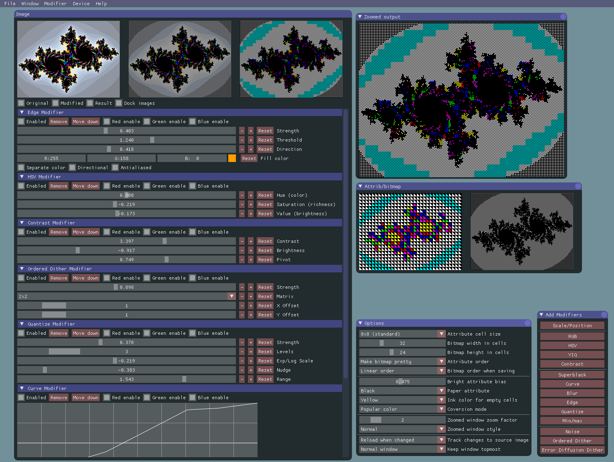
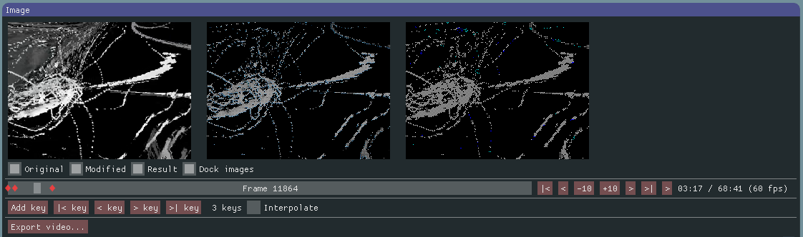
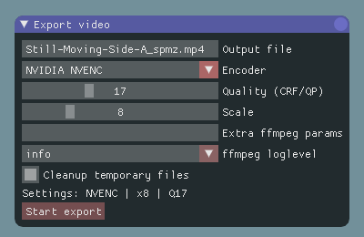

# Image Spectrumizer 5.5 — Описание

GUI-утилита для конвертации изображений в формат ZX Spectrum и других ретро-платформ, с **обработкой видео**, **интерполяцией ключевых кадров** и **CLI-режимом пайпов**.

Оригинальный проект: [Jari Komppa](https://github.com/jarikomppa/img2spec). Расширение (видео, ключевые кадры, CLI, экспорт): [nodeus](https://nodeus.ru).

### Скриншоты

| Главное окно | Ключевые кадры | Экспорт |
|-------------|---------------|---------|
|  |  |  |

---

## Возможности

### Конвертация изображений

Преобразование изображений в форматы ретро-платформ с интерактивным предпросмотром в реальном времени:

| Устройство | Разрешение | Описание |
|-----------|-----------|----------|
| **ZX Spectrum** | 256x192 | Стандартный экран (ячейки 8x8, 2 цвета на ячейку) |
| **ZX 3x64** | 256x192 | Три набора атрибутов, мерцание даёт ~192 цвета на CRT |
| **C64 HiRes** | 320x200 | Commodore 64, high-res режим |
| **C64 Multicolor** | 160x200 | Commodore 64, мультицвет (4 цвета на ячейку 8x8) |

### Модификаторы (14 штук, стековые, real-time)

ScalePos, Quantize, Ordered Dither, Error Diffusion Dither, Edge, Blur, Min/Max, HSV, YIQ, RGB, Contrast, Curve, Noise, SuperBlack

### Форматы экспорта

PNG, бинарный SCR (`.scr`), C-заголовок (`.h`), ассемблер-include (`.inc`)

### Видео-режим

- Загрузка видеофайлов (MP4, MOV, AVI и др.) через ffmpeg
- Таймлайн с перемоткой по кадрам
- Воспроизведение/пауза, кнопки пропуска кадров
- Все модификаторы применяются к каждому кадру в реальном времени
- Экспорт: NVIDIA NVENC (HEVC), AMD AMF (HEVC) или x264 (H.264)
- Настройка качества (CRF/QP) и множителя масштаба (1x-32x)
- Аудио мультиплексируется из источника после экспорта

### Ключевые кадры видео

- Сохранение полных снимков модификаторов + устройства на конкретных кадрах
- Автозахват: изменение параметров на текущем кадре автоматически создаёт/обновляет ключевой кадр
- Hold-семантика: настройки действуют от ключевого кадра до следующего
- **Интерполяция**: плавные переходы параметров между ключевыми кадрами (чекбокс + флаг `--interpolate`)
- Маркеры на таймлайне (красные ромбы)
- Навигация: `|< key`, `< key`, `> key`, `>| key`
- Хранение: `<video>.keyframes.json` рядом с видеофайлом

### CLI и режим пайпа

```
img2spec input.png workspace.isw -p output.png
```

| Флаг | Описание |
|------|----------|
| `-p <файл>` | Сохранить PNG |
| `-h <файл>` | Сохранить C-заголовок |
| `-i <файл>` | Сохранить ассемблер-include |
| `-s <файл>` | Сохранить SCR |
| `--pipe --width W --height H` | Обработка RAW RGB24 кадров через stdin/stdout |
| `--interpolate` | Включить интерполяцию ключевых кадров в режиме пайпа |
| `--keys <файл>` | Загрузить ключевые кадры для переключения параметров |
| `--batch-stdin` | Пакетная обработка (JSON-строки из stdin) |

### Пайп экспорта видео

```
ffmpeg (декодирование) -> img2spec --pipe (обработка) -> ffmpeg (кодирование + масштабирование)
```

- Кадры передаются через анонимные пайпы (без записи на диск)
- img2spec обрабатывает в разрешении устройства (например, 256x384)
- ffmpeg масштабирует выход до `разрешение_устройства x множитель`
- Аудио мультиPLEXируется из источника

---

## Сборка

### CMake (кроссплатформенная)

```bash
mkdir build && cd build
cmake ..
make
```

Зависимости: SDL2, OpenGL. На Linux: GTK3. На macOS: AppKit.

### Visual Studio

Открыть `img2spectrum.vcxproj`. Тулсет v120 (VS2013). Конфигурации Win32 и x64.

---

## Библиотеки и лицензии

| Библиотека | Лицензия | URL |
|-----------|---------|-----|
| **img2spec** | zlib/libpng | https://github.com/jarikomppa/img2spec |
| **SDL2** | zlib | https://www.libsdl.org/ |
| **Dear ImGui** | MIT | https://github.com/ocornut/imgui |
| **Parson** | MIT | https://github.com/kgabis/parson |
| **stb libraries** | Public Domain | https://github.com/nothings/stb |
| **ffmpeg** | GPL/LGPL | https://ffmpeg.org/ |

---

## Ссылки

- Оригинальный проект: https://github.com/jarikomppa/img2spec
- Форк (видео + ключевые кадры + CLI): https://github.com/nodeus/img2spec_video
- Автор: https://nodeus.ru
